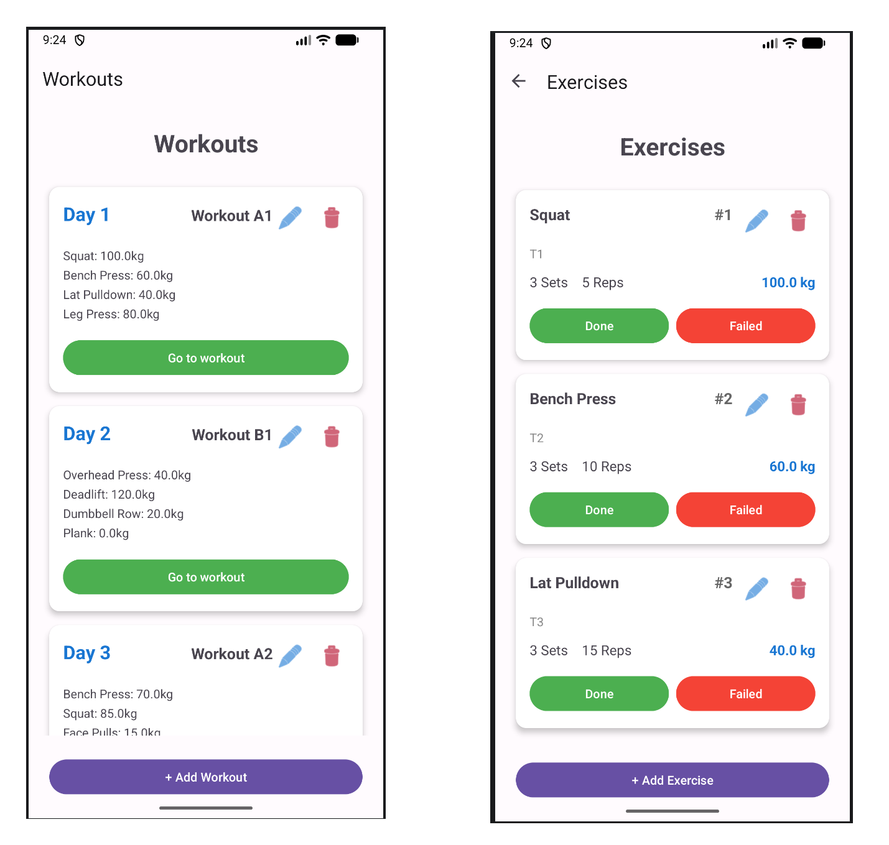

# GZCLP Planner

This project is a test project by myself because I wanted to automate the tracking of my training progress to avoid mistakes.
This app (GZCLP Planner) is an Android application designed to help me track my progress using the **GZCLP** linear progression program.

## What is GZCLP?

GZCLP is a beginner-friendly adaptation of the GZCL method created by Cody LeFever. It follows a "pyramid" structure focusing on three tiers of intensity:
- **Tier 1 (T1):** Heavy compound lifts (e.g., Squat, Bench Press) performed for low reps (e.g., 3x5) to build maximal strength.
- **Tier 2 (T2):** Secondary compound lifts performed for moderate reps (e.g., 3x10) for hypertrophy and skill practice.
- **Tier 3 (T3):** Accessory exercises performed for high reps (3x15+) to address weaknesses and build volume.

The program is famous for its failure protocol: instead of immediately deloading when a weight becomes too heavy, you transition through different rep schemes (e.g., 5x3 -> 6x2 -> 10x1) to keep lifting heavy before eventually resetting.
Links for more detailed information:
- https://thefitness.wiki/routines/gzclp/
- https://www.reddit.com/r/Fitness/comments/6pjiwd/heres_a_quick_summary_of_the_gzclp_linear/

## Current State & Features

At its current state, the app provides the following capabilities:
- **Default Program Setup:** Automatically initializes a classic 4-day GZCLP split (A1, B1, A2, B2) with standard exercises and weights.
- **Exercise Tracking:** Users can view their current workout and mark exercises as "Success" or "Failure".
- **Automatic Progression:**
    - On **Success**: Automatically increases weight (5kg for lower body, 2.5kg for upper body).
    - On **Failure**: Automatically progresses to the next iteration in the cycle (e.g., moving from 3x10 to 3x8 in T2).
    - **Weight Resets**: Handles the 85% reset for T1 and specific reset logic for T2/T3 when the final stage of a cycle is failed.
- **Workout Management:** Supports adding, editing, and deleting workouts and exercises.
- **Dynamic UI:** Real-time updates of exercise details (sets, reps, weights) as they change.
- **Editing:** Allows users to add, edit and delete workouts and exercises.

In this first Version (v0.1) it looks like this:

## Implementation Details

- **Database (Room Persistence Library):** The app uses **Room**, an abstraction layer over SQLite
    - **Functionality:** Room provides an abstraction layer over SQLLite which makes it easy to handle (https://developer.android.com/training/data-storage/room)
    - **Use in Project:** The database reflects the GZCLP structure through entities like `WorkoutEntity`, `ExerciseEntity`, `CycleEntity`, and `IterationEntity`
- **App Logic:** The GZCLP-specific rules are encapsulated within the `applogic` package. This logic is independent of the Android framework, making it possible to maintain and test isolated
- **UI Components:**
    - **Navigation Component:** For seamless fragment transitions
    - **View Binding:** For interaction with layout views
    - **RecyclerViews:** Custom adapters (`WorkoutAdapter`, `ExerciseAdapter`) manage the display of lists
- **Concurrency:** Database operations are handled via a dedicated `ExecutorService`
